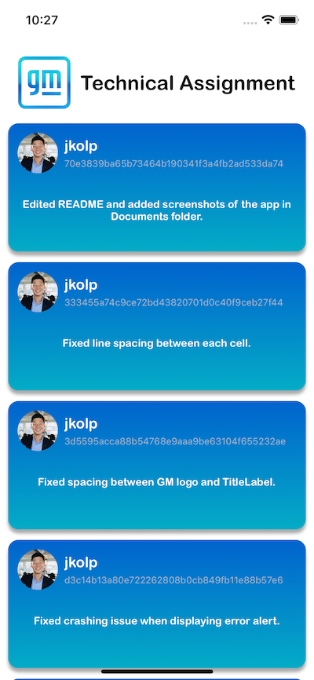

# GM Technical Assignment

An app that displays the list of commits made during the development of this app. 
Take home project assigned by GM.

## Features

- Display the list of commits 
- Pull to reload the data with the newst commits at the top
- Error handlers : Display error alert messages if : 
        1) No commits were found
        2) Bad internet connection
        3) Server error from Github.

## Screenshots

### TO-DO

 - [ ] Make the header for the collectionview sticky when pull-down-reload
 - [ ] Cache commits 
 
